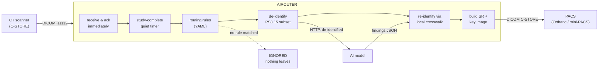

# dicom-ai-router

[](https://github.com/seth2177/dicom-ai-router/actions/workflows/ci.yml) [](https://pypi.org/project/dicom-ai-router/)

**Get imaging AI into a live radiology workflow and back out again, without leaking PHI or slowing the scanner.**

A working reference implementation of the part of clinical AI that usually breaks: the plumbing between the modality, the AI model and PACS. It receives studies over DICOM, routes them by header rules, de-identifies them, calls a model, rebuilds the answer as DICOM inside the patient's original study, and delivers it to PACS. Every hop is audited.




*Key image as it lands in PACS: the finding is circled, "NOT FOR DIAGNOSIS" is burned in, and the image sits in the real patient's study. The model itself only ever saw pseudonymous UIDs.*

 *A daily-QA phantom with a +9 HU CT-number drift: five ROIs, a FAIL verdict and the reason, returned to PACS as a key image and SR.*

## Run it (about 2 minutes)

Requires Python 3.11+.

```bash
git clone https://github.com/seth2177/dicom-ai-router && cd dicom-ai-router
python -m pip install -r requirements.txt        # Windows: py -3.12 -m pip install -r requirements.txt
python run_demo.py                               # Windows: py -3.12 run_demo.py
```

Or install it from PyPI and run the same demo from any folder:

```bash
pip install dicom-ai-router
dicom-ai-router demo
```

Install from PyPI, run from source, or use the container (`docker compose up --build`, below).

That one command starts a mini-PACS, the model server and the router. A synthetic CT scanner then sends a mix of
chest CTs, head CTs and daily-QA water phantoms (some with injected CT-number drift or cupping):

```
  patient            truth                router   AI said                                            PACS got
  QA^DAILY           QA FAIL (+9/2)       DONE     FAIL; CT +8.8 HU (water), noise 4.8 HU, uniformity OT,SR
  SYNTHETIC^CARLOS   8mm right GGO        DONE     no finding                                         OT,SR
  SAMPLE^CARLOS      18mm left            DONE     pulmonary nodule, left lung; 17.2 mm; 0.99         OT,SR
  TESTCASE^JANE      head CT              IGNORED  no routing rule matched                            -
  TESTCASE^ROBERT    14mm left GGO        DONE     no finding                                         OT,SR
  ...
  AI round-trip: median 175 ms over 11 studies
```

Phantoms go to `ct-qa` and chests go to the nodule model; the head CT matches no rule and never leaves the router.
The nodule misses are on purpose. The mock model can't see ground-glass nodules and under-measures some solid ones, and because every study carries ground truth, those errors can be measured (see *Next stages*).

Other things to try:

```bash
python run_demo.py --fail-rate 0.4     # flaky AI endpoint: watch retries with backoff keep studies flowing
python run_demo.py --transport stow-rs # images go to the model as DICOMweb STOW-RS instead of a form upload
python -m airouter status              # state of every study (after a demo run)
python -m pip install -r requirements-dev.txt && python -m pytest -q
                                       # PHI + site scrub, audit incl. negative control, receiver security,
                                       # SR structure and revisions, QA model, routing, both model transports,
                                       # container config, end to end over real DICOM networking
docker compose up --build              # router + mock AI + Orthanc PACS at http://localhost:8042 (set AIROUTER_DEID_SALT first)
```

## What it handles, and why

| Real-world problem | How the router handles it | Where |
|---|---|---|
| Phantom / daily-QA scans reaching a clinical model (junk findings, per-study billing) | QA rule first: `QualityControlImage=YES` plus vendor conventions; QA goes to a real `ct-qa` model, calibration scans are held | `router.yaml`, `airouter/mock_ai/qa.py` |
| A slow receiver backs up the scanner's send queue | Answers C-STORE `Success` immediately, then does all work on worker threads | `router.py` |
| DICOM has no "study finished" message | Quiet-period timer per study, tunable per site | `router.py`, `router.yaml` |
| Headers are inconsistent (blank BodyPartExamined) | Ordered regex rules with fallbacks; no match means nothing leaves | `rules.py` |
| PHI must not reach the model or vendor | PS3.15 Basic Profile subset: every date and every UID by VR, identity and site attributes, free-text patterns, private tags, overlays, preamble; burned-in images dropped | `deid.py` |
| Pseudonyms can be brute-forced if the salt is known | Keyed HMAC pseudonyms; the salt comes from `AIROUTER_DEID_SALT` and the router refuses to start without a strong one | `deid.py`, `config.py` |
| Results must land on the right patient | Deterministic pseudonymous UIDs plus a local crosswalk | `deid.py`, `store.py` |
| Untrusted network input | UIDs validated before they become file paths; called AE enforced; optional calling-AE allow-list; atomic writes | `router.py` |
| Real studies contain localizers and dose screens | Dropped per image and audited, never failing the study; `series: largest` for single-volume models | `pipeline.py` |
| Radiologists need to see it; systems need to parse it | Basic Text SR *and* a Secondary Capture key image, both in the original study | `results.py` |
| Late images change the answer after a result is already in PACS | The revised SR is a new instance that references the one it replaces (`PredecessorDocumentsSequence`); the chain is kept in SQLite, so it survives restarts | `results.py`, `pipeline.py`, `store.py` |
| Picky PACS reject associations | Proposes only the SOP classes actually being sent | `sender.py` |
| Model vendors want a standard upload, not a bespoke API | Per endpoint, `transport: stow-rs` sends the de-identified instances as a DICOMweb STOW-RS request (multipart/related, PS3.18); the form upload stays the default | `ai_client.py`, `router.yaml` |
| Models and networks fail | Retry with exponential backoff; 4xx never retried; failures recorded, never dropped | `ai_client.py`, `sender.py` |
| Security review and turnaround time | JSONL audit of every hop with ms timings, no names or MRNs; can also go to stdout for a log shipper | `audit.py` |
| Hospital IT wants it in their cloud account, reachable only over the site VPN | CloudFormation reference: one Fargate task behind an internal NLB open only to the site CIDR, encrypted EFS, salt in Secrets Manager, audit in CloudWatch Logs, no public IPs. Linted, not deployed by CI | `deploy/aws/`, `docs/AWS.md` |

**Walkthrough of every hop:** [docs/HOW-IT-WORKS.md](https://github.com/seth2177/dicom-ai-router/blob/main/docs/HOW-IT-WORKS.md)

**Running it on AWS:** [docs/AWS.md](https://github.com/seth2177/dicom-ai-router/blob/main/docs/AWS.md), a CloudFormation reference deployment (ECS Fargate behind an internal NLB, EFS, Secrets Manager, CloudWatch Logs) with PHI/HIPAA notes and a cost estimate.

## Layout

```
airouter/          the router: receive, route, de-identify, infer, build results, send, audit
                   site_scrub.py + phi_audit.py: publish-grade site scrub and its independent audit
airouter/mock_ai/  model server: lung-nodule (explainable stand-in) and ct-qa (real phantom QA measurement)
airouter/tools/    synthetic CT scanner and mini-PACS
config/            router.yaml: AE titles, ports, endpoints, rules, de-id salt
                   router.docker.yaml: the container config; site values come from ${...} environment variables
deploy/aws/        CloudFormation reference deployment (ECS Fargate, internal NLB, EFS, Secrets Manager)
docs/              HOW-IT-WORKS.md (every hop), AWS.md (deploy, PHI/HIPAA notes, cost)
tests/             unit and end-to-end tests over real DICOM networking on localhost
run_demo.py        the whole pipeline in one command
```

## Next stages

**[llm-eval-radiology](https://github.com/seth2177/llm-eval-radiology).** Every processed study leaves `data/results/<uid>.json` (what the AI said) next to `data/truth/<uid>.json` (what was really there). Stage 2 adds an LLM that drafts a report impression from the findings, then scores both layers against ground truth:

- **Detector:** sensitivity and specificity by size and density, laterality errors, measurement error
- **LLM report:** hallucinated or omitted findings, flipped laterality, altered measurements, missing follow-up language

**[hl7v2-fhir-bridge](https://github.com/seth2177/hl7v2-fhir-bridge).** The orders and reports around those studies still travel as HL7 v2. The bridge turns the radiology feed (ADT, ORM/OMI, ORU) into FHIR R4, so the order, the report and the imaging study the router worked on end up as linked FHIR resources.

## Running the router for real

```bash
export AIROUTER_DEID_SALT=$(python -c "import secrets; print(secrets.token_hex(32))")   # keep this secret, and stable
python -m airouter serve --config config/router.yaml
```

Windows PowerShell:

```powershell
$env:AIROUTER_DEID_SALT = py -3.12 -c "import secrets; print(secrets.token_hex(32))"
py -3.12 -m airouter serve --config config/router.yaml
```

The demo generates a throwaway salt on every run. The service refuses to start without a real one.

## Quality

- The test suite runs in CI on Linux and Windows, Python 3.11 and 3.12, plus `ruff`, and `cfn-lint` on the AWS template.
- Every SR and Secondary Capture the router produces validates against the DICOM standard (2026d IOD
  definitions, `dicom-validator`).
- Adversarial testing, including attacking my own scrubber and audit, found real problems: a default salt
  that made pseudonyms reversible, a multi-valued name that leaked past the audit, person names nested in
  sequences reaching the model, a path traversal in the receiver, SR evidence grouped wrongly for
  multi-series studies, and a dose SR that could stop a study being routed. Each is fixed and has a
  regression test that fails on the old code (`tests/test_security.py`).
  Known limits are listed under *Scope and safety*.

## Scope and safety

Known limits: the de-identification is a documented subset of PS3.15, not a certified profile. It retains
study and series descriptions, which are pattern-scrubbed. Pixel data is never altered, so burned-in images are
dropped. With `transport: stow-rs` the request is DICOMweb STOW-RS, but the model answers with the router's
findings JSON, not a PS3.18 Store Instances Response. Neither transport sends credentials (no bearer token or mTLS
to the model). The router never deletes its inbox copies, so storage grows until a retention job exists. DICOM
in and out is plain DICOM, not DICOM TLS; it relies on the network path (VPN) for encryption. Study state is SQLite,
so one router instance per working directory.

This is a demonstration and reference build, not a medical device. All patients, identifiers and images in the repo are synthetic. The de-identification covers a documented subset of the standard and does not alter pixel data. Don't point it at production PHI without a formal review.

---

Built by **Seth Turnbo**: 23 years on MRI/CT (GE, Philips, Siemens), multi-vendor DICOM/HL7/PACS integration. [LinkedIn](https://www.linkedin.com/in/sethturnbo)
