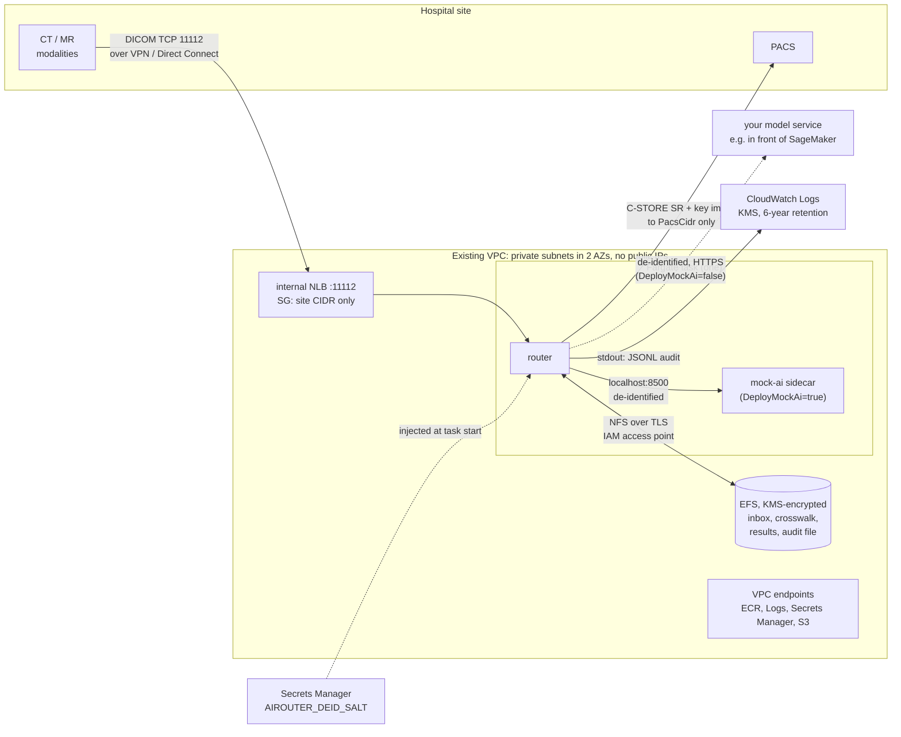

# AWS reference deployment

`deploy/aws/airouter.yaml` is a CloudFormation template that runs the router on ECS Fargate in an existing VPC that
the hospital already reaches over a site-to-site VPN or Direct Connect. It works in any commercial region; the
commands below use `us-east-2`. It is a reference build: it passes `cfn-lint` and has not been deployed as part
of this repo's CI.

## What it builds



| Piece | How it is set up |
|---|---|
| Compute | ECS Fargate service, exactly one task: the router container, plus the mock model as a sidecar on `127.0.0.1:8500` when `DeployMockAi=true`. Both use the repo's `Dockerfile` image. Root filesystem read-only, all Linux capabilities dropped, non-root user 10001. |
| DICOM in | Internal Network Load Balancer, TCP 11112, in the private subnets. Its security group admits only `SiteCidr`; the task's security group admits only the NLB. |
| Results out | Task egress to `PacsCidr` on `PacsPort` (C-STORE), and to `AiEgressCidr:AiEgressPort` only when an external model is configured. |
| State | EFS (elastic throughput, KMS-encrypted, AWS Backup on, files moved to Infrequent Access after 30 days) mounted at `/data` through an access point with IAM authorization and TLS. The file system policy denies any non-TLS access. |
| De-id salt | Secrets Manager secret, 64 random characters, generated by CloudFormation, injected as `AIROUTER_DEID_SALT`. Nobody types it or sees it in a parameter. |
| Audit | `AIROUTER_AUDIT_STDOUT=1` makes the router print every audit line to stdout as well as writing `audit.jsonl` on EFS; the `awslogs` driver ships it to `/airouter/<stack>` (KMS-encrypted, retention 6 years by default). |
| AWS APIs | Interface endpoints for ECR (api, dkr), CloudWatch Logs and Secrets Manager, and an S3 gateway endpoint limited to ECR's layer bucket. No NAT gateway, no internet gateway needed. Set `CreateVpcEndpoints=false` if the VPC already has them. |
| IAM | Execution role: pull from one ECR repository, write to one log group, read one secret (KMS decrypt only via Secrets Manager). Task role: mount and write the one EFS file system, only through the access point. `ecr:GetAuthorizationToken` is the one `*` resource, because that action cannot be scoped. |
| Encryption at rest | One customer-managed KMS key with rotation, used by EFS, the secret and the log group. |

Site settings reach the router as environment variables (`AIROUTER_PACS_HOST`, `AIROUTER_AI_URL_LUNG_NODULE`, ...),
which `config/router.docker.yaml` reads through `${NAME:-default}` placeholders. The same file runs
`docker compose` on its defaults.

**Why one task.** The crosswalk and study state live in SQLite on EFS, which wants a single writer. The service runs
one task and deploys with `MinimumHealthyPercent: 0` / `MaximumPercent: 100`, so the old task stops before the new
one starts. That is a short DICOM outage on each deploy; modalities queue and retry. Scaling out would need the store
moved to a database (RDS), which this template does not do.

### Pointing it at a real model

Set `DeployMockAi=false` and give `LungNoduleUrl` / `CtQaUrl` (and `AiTransport`: `multipart` or `stow-rs`). The
router sends a plain HTTP(S) POST and does not sign requests or send a token. A SageMaker endpoint (or a Bedrock
API) requires SigV4-signed calls, so put a small service in the VPC in front of it: it accepts the router's request,
calls `InvokeEndpoint` with its own IAM role, and returns the findings JSON the router expects
(`docs/HOW-IT-WORKS.md`, Hop 6). That adapter is not part of this template. Restrict `AiEgressCidr` to where it runs.

## Build the image and push it to ECR

The template pulls `<account>.dkr.ecr.<region>.amazonaws.com/<EcrRepositoryName>:<ImageTag>`. Create the repository
once, then build and push. Build for `linux/amd64` (the task runs on X86_64), including from an ARM Mac.

bash:

```bash
REGION=us-east-2
ACCOUNT=$(aws sts get-caller-identity --query Account --output text)
REGISTRY=$ACCOUNT.dkr.ecr.$REGION.amazonaws.com
REPO=dicom-ai-router
TAG=$(git rev-parse --short HEAD)

aws ecr create-repository --region $REGION --repository-name $REPO \
  --image-scanning-configuration scanOnPush=true --image-tag-mutability IMMUTABLE \
  --encryption-configuration encryptionType=KMS
aws ecr get-login-password --region $REGION | docker login --username AWS --password-stdin $REGISTRY
docker build --platform linux/amd64 -t $REGISTRY/$REPO:$TAG .
docker push $REGISTRY/$REPO:$TAG
```

PowerShell:

```powershell
$Region   = "us-east-2"
$Account  = aws sts get-caller-identity --query Account --output text
$Registry = "$Account.dkr.ecr.$Region.amazonaws.com"
$Repo     = "dicom-ai-router"
$Tag      = git rev-parse --short HEAD

aws ecr create-repository --region $Region --repository-name $Repo `
  --image-scanning-configuration scanOnPush=true --image-tag-mutability IMMUTABLE `
  --encryption-configuration encryptionType=KMS
aws ecr get-login-password --region $Region | docker login --username AWS --password-stdin $Registry
docker build --platform linux/amd64 -t "$Registry/${Repo}:$Tag" .
docker push "$Registry/${Repo}:$Tag"
```

## Deploy

You need: the VPC ID and CIDR, two private subnets in different AZs and their route tables, the site CIDR, and the
PACS AE title, address and port. The S3 prefix list ID is region-specific and is looked up below. Validate first:

```bash
pip install cfn-lint && cfn-lint deploy/aws/airouter.yaml
```

bash:

```bash
S3_PL=$(aws ec2 describe-managed-prefix-lists --region $REGION \
  --filters Name=prefix-list-name,Values=com.amazonaws.$REGION.s3 --query 'PrefixLists[0].PrefixListId' --output text)

aws cloudformation deploy --region $REGION --stack-name airouter \
  --template-file deploy/aws/airouter.yaml --capabilities CAPABILITY_IAM \
  --parameter-overrides \
    VpcId=vpc-0123456789abcdef0 VpcCidr=10.20.0.0/16 \
    PrivateSubnet1=subnet-0aaaaaaaaaaaaaaaa PrivateSubnet2=subnet-0bbbbbbbbbbbbbbbb \
    PrivateRouteTableIds=rtb-0aaaaaaaaaaaaaaaa,rtb-0bbbbbbbbbbbbbbbb S3PrefixListId=$S3_PL \
    SiteCidr=10.50.0.0/16 AllowedCallingAes="CT01, CT02" \
    PacsAeTitle=PACS PacsHost=10.50.1.20 PacsPort=104 PacsCidr=10.50.1.20/32 \
    ImageTag=$TAG

aws cloudformation describe-stacks --region $REGION --stack-name airouter \
  --query "Stacks[0].Outputs" --output table
```

PowerShell:

```powershell
$S3Pl = aws ec2 describe-managed-prefix-lists --region $Region `
  --filters "Name=prefix-list-name,Values=com.amazonaws.$Region.s3" --query "PrefixLists[0].PrefixListId" --output text

aws cloudformation deploy --region $Region --stack-name airouter `
  --template-file deploy/aws/airouter.yaml --capabilities CAPABILITY_IAM `
  --parameter-overrides `
    VpcId=vpc-0123456789abcdef0 VpcCidr=10.20.0.0/16 `
    PrivateSubnet1=subnet-0aaaaaaaaaaaaaaaa PrivateSubnet2=subnet-0bbbbbbbbbbbbbbbb `
    PrivateRouteTableIds=rtb-0aaaaaaaaaaaaaaaa,rtb-0bbbbbbbbbbbbbbbb S3PrefixListId=$S3Pl `
    SiteCidr=10.50.0.0/16 "AllowedCallingAes=CT01, CT02" `
    PacsAeTitle=PACS PacsHost=10.50.1.20 PacsPort=104 PacsCidr=10.50.1.20/32 `
    ImageTag=$Tag

aws cloudformation describe-stacks --region $Region --stack-name airouter `
  --query "Stacks[0].Outputs" --output table
```

The `DicomEndpoint` output is what goes into each modality's DICOM node list (AE title, the NLB's DNS name or one of
its private IPs, port 11112). The PACS must know the router's AE title as a sender. To read the audit trail in
CloudWatch Logs Insights:

```
fields @timestamp, study, step, ok, ms, rule, error
| filter ispresent(step)
| sort @timestamp desc
```

To ship a new image, push it with a new tag and re-run `deploy` with `ImageTag=<new tag>`.

## Teardown

Deleting the stack removes the service, load balancer, endpoints, roles and security groups. Four resources are
**retained on purpose**, because losing them loses records or the ability to link results to patients: the EFS file
system (identified images and the crosswalk), the de-id salt secret, the KMS key that encrypts both, and the audit
log group. Check your retention obligations before deleting them. EFS backups made by AWS Backup stay in the
`aws/efs/automatic-backup-vault` vault until you delete those recovery points.

bash:

```bash
out() { aws cloudformation describe-stacks --region $REGION --stack-name airouter \
          --query "Stacks[0].Outputs[?OutputKey=='$1'].OutputValue" --output text; }
FS=$(out FileSystemId); SECRET=$(out DeidSaltSecretArn); KEY=$(out KmsKeyArn); LOGS=$(out AuditLogGroup)

aws cloudformation delete-stack --region $REGION --stack-name airouter
aws cloudformation wait stack-delete-complete --region $REGION --stack-name airouter

# Only when the data and audit records are no longer needed:
aws efs delete-file-system --region $REGION --file-system-id $FS
aws secretsmanager delete-secret --region $REGION --secret-id $SECRET --recovery-window-in-days 7
aws logs delete-log-group --region $REGION --log-group-name $LOGS
aws kms schedule-key-deletion --region $REGION --key-id $KEY --pending-window-in-days 7
aws ecr delete-repository --region $REGION --repository-name $REPO --force
```

PowerShell:

```powershell
function Get-StackOutput($Name) { aws cloudformation describe-stacks --region $Region --stack-name airouter `
  --query "Stacks[0].Outputs[?OutputKey=='$Name'].OutputValue" --output text }
$Fs = Get-StackOutput FileSystemId; $Secret = Get-StackOutput DeidSaltSecretArn
$Key = Get-StackOutput KmsKeyArn; $Logs = Get-StackOutput AuditLogGroup

aws cloudformation delete-stack --region $Region --stack-name airouter
aws cloudformation wait stack-delete-complete --region $Region --stack-name airouter

# Only when the data and audit records are no longer needed:
aws efs delete-file-system --region $Region --file-system-id $Fs
aws secretsmanager delete-secret --region $Region --secret-id $Secret --recovery-window-in-days 7
aws logs delete-log-group --region $Region --log-group-name $Logs
aws kms schedule-key-deletion --region $Region --key-id $Key --pending-window-in-days 7
aws ecr delete-repository --region $Region --repository-name $Repo --force
```

## PHI and HIPAA

**The BAA.** Before any PHI touches the account, accept the AWS Business Associate Addendum in AWS Artifact (for the
account, or for the organization). It covers only HIPAA-eligible services, used as the BAA requires. Everything
this template uses (ECS on Fargate, ECR, Elastic Load Balancing, EFS, AWS Backup, Secrets Manager, KMS, CloudWatch
Logs, VPC endpoints) is on AWS's HIPAA Eligible Services Reference; check the current list when you deploy.

**What the BAA does not do.** It makes AWS your business associate for its side of the shared responsibility model.
It does not make this deployment compliant. The hospital's risk analysis, who gets IAM access to the log group, the
file system and the secret, account-level CloudTrail, GuardDuty and Config, incident response and workforce training
are yours, and this template creates none of the account-level controls.

**Where PHI lives in this design.**

| Place | Contains | Treat as |
|---|---|---|
| EFS `/data/inbox` | Every received image, fully identified. Never purged by the router. | PHI |
| EFS `router.sqlite` | The crosswalk from pseudonymous to real UIDs, study state, the SR chain | PHI (it is the re-identification key) |
| EFS `results/`, `audit.jsonl`; the log group | Real Study Instance UIDs, AE titles, rule and model names, timings. No names or MRNs. | PHI: UIDs can be linked back to a patient |
| Secrets Manager | The de-id salt. With it, pseudonyms of guessable values (MRNs, dates) can be brute-forced. | Secret |
| AWS Backup vault | Copies of the EFS contents | PHI |
| Model request | De-identified images (`ANON^...`, `2.25...` UIDs, dates emptied) | See below |

**The model is outside the BAA's scope unless it runs in your account.** The router's de-identification is a
documented subset of DICOM PS3.15. It is not HIPAA Safe Harbor or Expert Determination, and it does not touch pixel
data. So treat what goes to the model as PHI: a third-party model operator needs its own BAA with the covered entity,
and a model you host yourself (for example on SageMaker, which is HIPAA eligible) needs the same controls as the rest
of this account. The router does not authenticate to the model; the network path (`AiEgressCidr` and the model
service's own security group) is the only control, so keep it narrow and use an `https://` URL.

**In transit.** DICOM between the site and the NLB, and from the router back to PACS, is plain DICOM: no DICOM TLS.
It is protected only by the network path. A site-to-site IPsec VPN encrypts it. Direct Connect does **not** encrypt
by default; use MACsec or run the VPN over Direct Connect. Inside the VPC, the NLB-to-task hop is unencrypted TCP.
EFS traffic is TLS (enforced by the file system policy).

**The mock model is for synthetic data.** With `DeployMockAi=true` the "model" is the repo's geometric stand-in. Use
that mode to prove the plumbing with synthetic studies sent over the VPN, not with patients:
`python -m airouter.tools.modality_sim --host <NLB address> --port 11112` (it calls as `CT_SIM01`, so add that to
`AllowedCallingAes` if you set a list).

This is not a medical device and the template has not been through a hospital security review. See *Scope and
safety* in the README.

## Rough monthly cost

An estimate to size the conversation, not a quote. Unit prices are on-demand list prices for `us-east-2` as I
understand them; confirm in the AWS Pricing Calculator before committing to anything.

Assumptions: 730 hours, one task of 1 vCPU / 4 GB (x86), two AZs, 1,000 CT studies a month at about 150 MB each, the
mock sidecar (no external model cost), the VPN or Direct Connect already exists (not counted), new VPC endpoints
created by this stack.

| Item | Basis | Per month |
|---|---|---|
| Fargate | 1 vCPU × $0.04048/h + 4 GB × $0.004445/h, 730 h | ≈ $42.50 |
| Network Load Balancer | $0.0225/h + light NLCU use | ≈ $18 |
| Interface endpoints | 4 endpoints × 2 AZs × $0.01/h (S3 gateway endpoint is free) | ≈ $58.40 |
| EFS storage | ~75 GB average in month 1 × $0.30/GB-month (Standard) | ≈ $22.50 |
| EFS throughput (elastic) | 150 GB written × $0.06/GB + 150 GB read × $0.03/GB | ≈ $13.50 |
| AWS Backup (EFS) | ~150 GB warm × $0.05/GB-month, incremental | ≈ $7.50 |
| KMS | 1 key × $1 + requests | ≈ $1 |
| Secrets Manager | 1 secret × $0.40 | $0.40 |
| CloudWatch Logs | audit lines (~6 MB) plus service logs, well under 1 GB | < $1 |
| **Total, month 1** | | **≈ $165** |

What moves it:

- **Storage grows every month.** The router never deletes its inbox, so at this volume EFS gains about 150 GB a month.
  The lifecycle policy moves files untouched for 30 days to Infrequent Access (much cheaper per GB than Standard),
  but storage and backup cost still climb until there is a retention job. That job is not built yet.
- **VPC endpoints are the biggest fixed cost.** If the VPC already has them (`CreateVpcEndpoints=false`), the month-1
  figure drops to about $107.
- **Fargate scales with model size.** A real model on GPU is not in this estimate; it runs wherever your model service
  runs.
- **Not included:** the VPN (about $36/month per connection plus data out) or Direct Connect, data transfer out to the
  site (results are a few hundred KB per study), CloudTrail and other account-level services.
